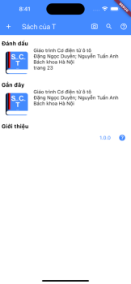
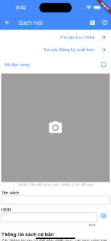
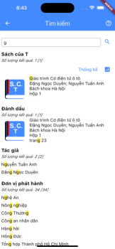

# Sách của T

Quản lý sách cá nhân

Tôi có một đống sách (giấy), tôi cất chỗ này để chỗ kia. Đến lúc cần tìm tôi phải đi lục lọi.

Để ghi nhớ tôi tạo lập 1 bảng tính, tuy nhiên thao tác khá bất tiện.

Nên tôi tự tạo cho mình 1 ứng dụng nhỏ, nhằm lưu trữ danh sách và tìm kiếm các cuốn sách của mình.

  

## Bản quyền và trách nhiệm

Ứng dụng này được cung cấp miễn phí và mã nguồn mở theo giấy phép GNU General Public License, bạn có thể xem chi tiết tại [LICENSE](LICENSE) hoặc [https://www.gnu.org/licenses/](https://www.gnu.org/licenses/). Bạn có thể tự do sử dụng, thay đổi, phân phối lại ứng dụng này theo các quy định của giấy phép trên.

Tôi hi vọng ứng dụng này có ích với bạn nhưng tôi không cung cấp bất cứ bảo hành hay trách nhiệm nào đối với việc sử dụng ứng dụng này.

Trong ứng dụng có liên kết đến 2 trang web công cộng bên ngoài [https://ppdvn.gov.vn/web/guest/tra-cuu-luu-chieu](https://ppdvn.gov.vn/web/guest/tra-cuu-luu-chieu) và [https://ppdvn.gov.vn/web/guest/ke-hoach-xuat-ban](https://ppdvn.gov.vn/web/guest/ke-hoach-xuat-ban). 2 trang web này không được cung cấp bởi tôi và không có mối quan hệ nào tới việc phát triển ứng dụng này. Ứng dụng chỉ đóng vai trò như 1 trình duyệt giúp bạn truy cập vào 2 trang web trên.

## Phiên bản

### 1.0.0

- Các chức năng cơ bản
- Dùng thử, sửa lỗi.

### 1.1.0

- Sửa các lỗi lặt vặt.
- Lọc bỏ các mục đã nhập ở chức năng gợi ý nhập ở màn hình nhập thông tin sách.
- Màn hình xem ảnh.
