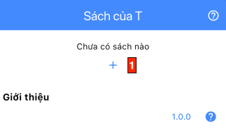
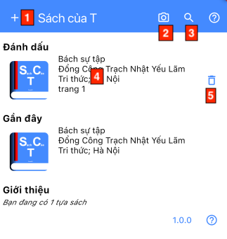

# Màn hình mở đầu

Đây là màn hình đầu tiên khi mở ứng.

Màn hình hiển thị khi chưa có đầu sách nào:

Màn hình hiển thị khi đã có dữ liệu, bao gồm 2 khối:
- Khối danh sách các đánh dấu sách.
- Khối danh sách các sách đã xem gần đây.

- Mục 1: nhấn vào để chuyển sang màn hình nhập thông tin sách mới.
- Mục 2: nhấn vào để quét mã vạch ISBN trên sách và tìm kiếm nhanh.
- Mục 3: nhấn vào để chuyển sang màn hình tìm kiếm.
- Mục 4: nhấn vào 1 dòng sách để chuyển sang màn hình thông tin chi tiết của sách.
- Mục 5: nhấn vào để xoá đánh dấu tương ứng.
