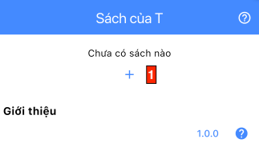
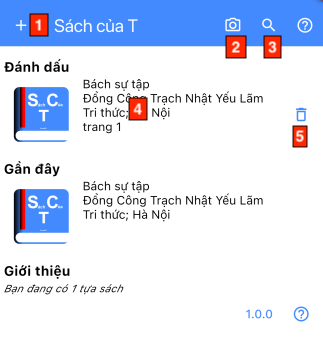
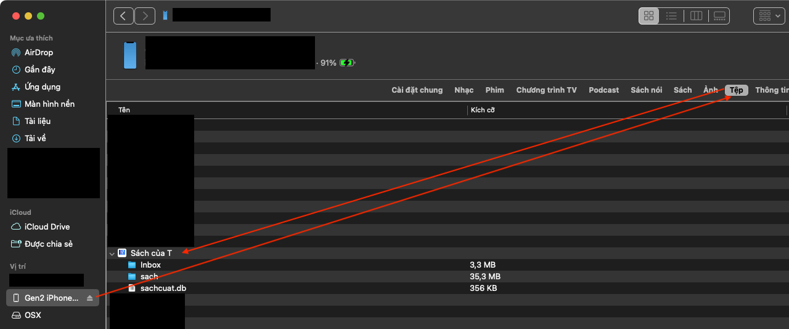
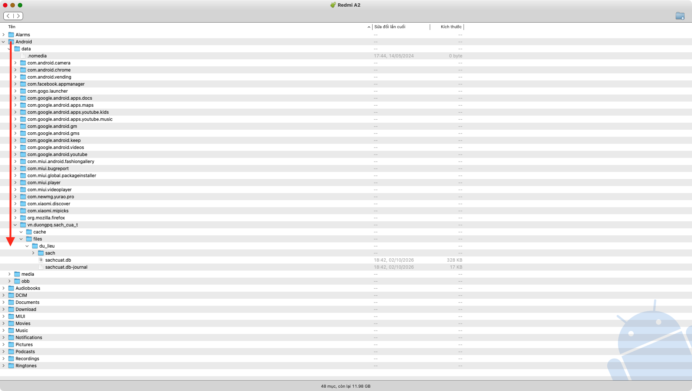

# Màn hình mở đầu

Đây là màn hình đầu tiên khi mở ứng.

Màn hình hiển thị khi chưa có đầu sách nào:

Màn hình hiển thị khi đã có dữ liệu, bao gồm 2 khối:
- Khối danh sách các đánh dấu sách.
- Khối danh sách các sách đã xem gần đây.

- Mục 1: nhấn vào để chuyển sang màn hình nhập thông tin sách mới.
- Mục 2: nhấn vào để quét mã vạch ISBN trên sách và tìm kiếm nhanh.
- Mục 3: nhấn vào để chuyển sang màn hình tìm kiếm.
- Mục 4: nhấn vào 1 dòng sách để chuyển sang màn hình thông tin chi tiết của sách.
- Mục 5: nhấn vào để xoá đánh dấu tương ứng.

 
 
 

# Sao lưu và khôi phục dữ liệu

Có thể sao lưu và khôi phục dữ liệu thông qua cáp USB và máy tính để bàn.

- Bước 1: kết thúc hoàn toàn ứng dụng trên điện thoại.
- Bước 2: kết nối điện thoại vào máy tính để bàn thông qua cáp USB.
  - Điện thoại iPhone - iOS: cần máy tính để bàn Mac OS. Mở **Finder**, chọn thiết bị điện thoại trên thanh điều hướng bên trái; chờ **Finder** nạp thông tin, sau đó di chuyển vào mục `Tệp`, mở rộng mục `Sách của T`.
  
  - Điện thoại Android: vào Settings (Trung tâm cấu hình) của điện thoại, tìm mục quản lý kết nối USB và chuyển loại kết nối USB sang `Truyền tệp` (`File transfer`). Sau đó có thể ứng dụng quản lý tệp của máy để bàn (đối với Mac OS có thể dùng [Android File Transfer](https://android.p2hp.com/filetransfer/index.html)), di chuyển vào thư mục `/Android/data/vn.duongpq.sach_cua_t/files/du_lieu`.
  
- Bước 3.1: để sau lưu dữ liệu, kéo thả (sao chép) tệp `sachcuat.db` và thư mục `sach` sang vị trí mới.
- Bước 3.2: để khôi phục dữ liệu, kéo thả tệp `sachcuat.db` và thư mục `sach` đã sao lưu trước đó ghi đè vào 2 mục tương ứng trên điện thoại.
