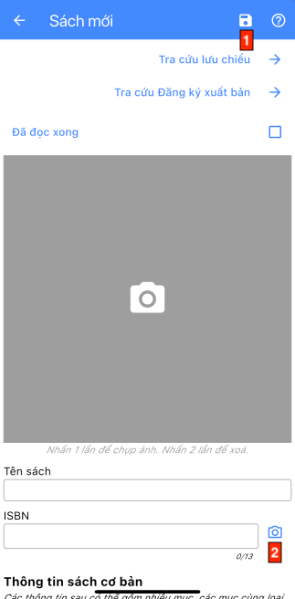
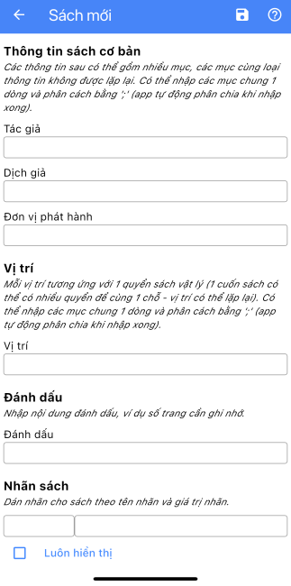
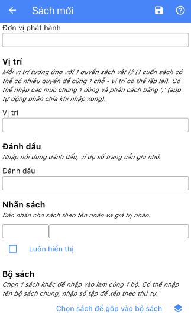
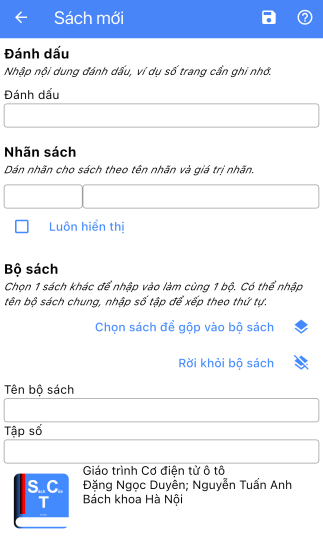
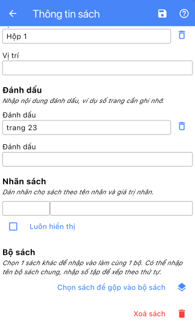

# Màn hình sách

Đây là màn hình nhập thông tin chi tiết của sách, hiển thị và sửa thông tin của sách đã nhập.

- Mục 1: nút Lưu.
- `Tra cứu lưu chiểu` & `Tra cứu Đăng ký xuất bản`: 2 lối tắt để chuyển sang màn hình web và mở các trang web *Lưu chiểu* và *Đăng ký xuất bản* của **Cục xuất bản, in và phát hành**, **Bộ văn hoá, thể thao và du lịch**, nhằm mục đích tra cứu, đối chiếu thông tin.

> Ghi chú: 2 trang trên không được cung cấp bởi ứng dụng này. Ứng dụng chỉ đóng vai trò như 1 trình duyệt web truy cập vào.

- `Đã đọc xong`: đánh dấu cuốn sách là đã đọc xong.
- Khung ảnh: nhấn vào để mở camera chụp ảnh. Nhấn 2 lần để xoá ảnh.
- Tên sách
- ISBN: có thể nhập trực tiếp mã số ISBN của sách hoặc nhấn nút số 2 để mở camera và quét mã vạch.

- Các thông tin cơ bản của sách: Tác giả, Dịch giả, Đơn vị phát hành.
- Một đầu sách có thể bao gồm nhiều thông tin cùng loại. Mỗi thông tin có thể được nhập vào 1 dòng riêng biệt.
- Bạn có thể nhập tất cả thông tin cùng loại vào cùng 1 dòng, phân tách bằng `;` (ví dụ: nhập vào dòng `Tác giả`: `Nguyễn Văn A;Trần Thị B`), ứng dụng sẽ tự chia tách thành các dòng tương ứng.
- Vị trí: chỉ nơi bạn lưu trữ cuốn sách. Trong một số trường hợp bạn có thể có nhiều cuốn của cùng 1 đầu sách, có thể lưu trữ nhiều nơi hoặc cùng một nơi. Vì vậy dòng Vị trí này cho phép bạn nhập nhiều dòng với cùng nội dung.
- Đánh dấu: đóng vai trò như ghi chú cho cuốn sách, ví dụ đánh dấu bạn đang đọc dở đến trang nào đó.
- Nhãn sách: bạn có thể dán nhãn để bổ sung các trường thông tin khác. Đánh dấu vào ô `Luôn hiển thị` để luôn hiển thị nhãn cho tất cả các sách (mặc định thì chỉ hiển thị nhãn có giá trị).

- Sách theo bộ: bạn có thể chọn 1 cuốn sách khác để nhập vào thành 1 bộ, đặt tên cho bộ sách, đánh số thứ tự (tập) cho sách hiện tại trong bộ sách.
- Mỗi cuốn sách chỉ có thể thuộc 1 bộ. Để thêm sách vào 1 bộ đã có, bạn chỉ cần chọn 1 cuốn sách trong bộ sách.

- Xoá sách: với trường hợp màn hình hiển thị thông tin sách đã lưu trước đó, bạn có thể xoá toàn bộ thông tin với nút đỏ cuối màn hình.
