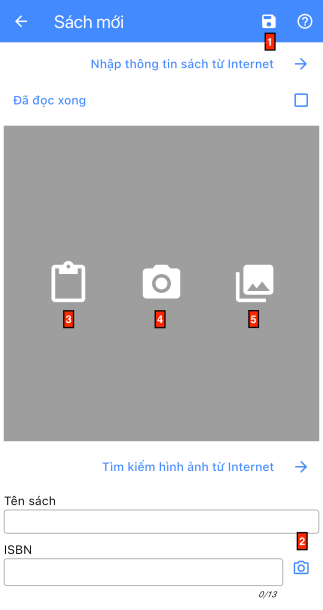
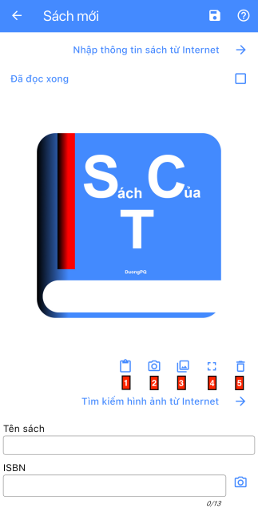
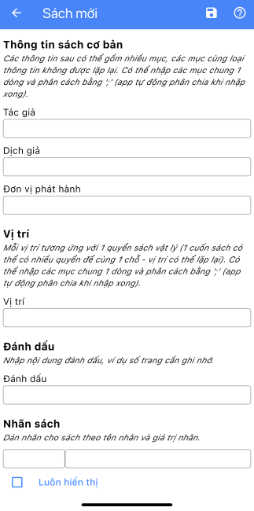
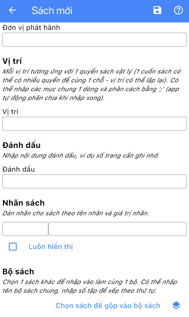
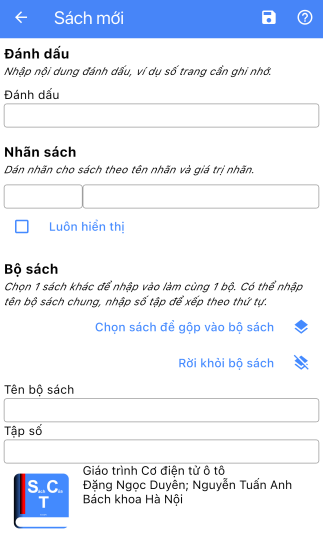
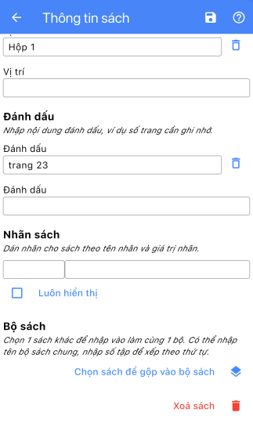

# Màn hình sách

Đây là màn hình nhập thông tin chi tiết của sách, hiển thị và sửa thông tin của sách đã nhập.

- Mục 1: nút Lưu.
- `Nhập thông tin sách từ Internet`: chuyển sang màn hình web để mở một số trang web, tìm kiếm và nhập thông tin của sách.
- `Đã đọc xong`: đánh dấu cuốn sách là đã đọc xong.
- Khung ảnh: trường hợp chưa cài đặt ảnh nào thì sẽ hiển thị 3 nút
  - 3: Dán
  - 4: Máy ảnh
  - 5: Kho ảnh
- Tìm kiếm hình ảnh từ Internet: mở trình duyệt web nhúng trong app (iOS: Safari, Android: Chrome) để tìm kiếm ảnh.
> Chi tiết cách lấy ảnh cho sách xem bên dưới.
- Tên sách
- ISBN: có thể nhập trực tiếp mã số ISBN của sách hoặc nhấn nút số 2 để mở camera và quét mã vạch.

Trường hợp khung ảnh có ảnh để hiển thị:
- Nút số 1: Dán
- Nút số 2: Chụp ảnh.
- Nút số 3: Kho ảnh.
- Nút số 4: Xem ảnh toàn màn hình. Hoặc có thể nhấn trực tiếp vào hình ảnh để xem ảnh toàn màn hình.
- Nút số 5: xoá ảnh.

- Các thông tin cơ bản của sách: Tác giả, Dịch giả, Đơn vị phát hành.
- Một đầu sách có thể bao gồm nhiều thông tin cùng loại. Mỗi thông tin có thể được nhập vào 1 dòng riêng biệt.
- Bạn có thể nhập tất cả thông tin cùng loại vào cùng 1 dòng, phân tách bằng `;` (ví dụ: nhập vào dòng `Tác giả`: `Nguyễn Văn A;Trần Thị B`), ứng dụng sẽ tự chia tách thành các dòng tương ứng.
- Vị trí: chỉ nơi bạn lưu trữ cuốn sách. Trong một số trường hợp bạn có thể có nhiều cuốn của cùng 1 đầu sách, có thể lưu trữ nhiều nơi hoặc cùng một nơi. Vì vậy dòng Vị trí này cho phép bạn nhập nhiều dòng với cùng nội dung.
- Đánh dấu: đóng vai trò như ghi chú cho cuốn sách, ví dụ đánh dấu bạn đang đọc dở đến trang nào đó.
- Nhãn sách: bạn có thể dán nhãn để bổ sung các trường thông tin khác. Đánh dấu vào ô `Luôn hiển thị` để luôn hiển thị nhãn cho tất cả các sách (mặc định thì chỉ hiển thị nhãn có giá trị).

- Sách theo bộ: bạn có thể chọn 1 cuốn sách khác để nhập vào thành 1 bộ, đặt tên cho bộ sách, đánh số thứ tự (tập) cho sách hiện tại trong bộ sách.
- Mỗi cuốn sách chỉ có thể thuộc 1 bộ. Để thêm sách vào 1 bộ đã có, bạn chỉ cần chọn 1 cuốn sách trong bộ sách.

- Xoá sách: với trường hợp màn hình hiển thị thông tin sách đã lưu trước đó, bạn có thể xoá toàn bộ thông tin với nút đỏ cuối màn hình.

## Xem ảnh toàn màn hình

Các thao tác trên màn hình xem ảnh toàn màn hình:
- Nhấn kép để thu phóng hình ảnh nhanh.
- Sử dụng 2 ngón tay di chuyển đồng thời trên màn hình theo 2 hướng ngược nhau (lại gần nhau hoặc tiến ra xa nhau) để thu phóng hình ảnh.

## Các cách để lấy ảnh cho sách

- Nhấn nút **Máy ảnh** để chụp ảnh trực tiếp.
- Nhấn nút **Kho ảnh** để mở màn hình kho ảnh của hệ thống để chọn.
- Nhấn nút **Dán** để lấy ảnh từ các phương thức khác, theo thứ tự ưu tiên sau đây:
  - Dán từ Clipboard/Pasteboard: từ ứng dụng bên ngoài, chọn ảnh muốn sử dụng, mở hộp thoại Chia sẻ (tuỳ thuộc ứng dụng có thể là nhấn nút Chia sẻ hoặc nhấn giữ ảnh), chọn `Sao chép ảnh` (lưu ý, tuỳ ứng dụng có hỗ trợ hay không mới có tuỳ chọn này. Nếu là `Sao chép` thì thường là sao chép URL của ảnh hơn là sao chép ảnh.). Quay lại `Sách của T` và nhấn nút **Dán**.
  - Sử dụng ảnh đã được chia sẻ: từ ứng dụng bên ngoài, chọn ảnh muốn sử dụng, mở hộp thoại Chia sẻ, chọn `Chia sẻ` và chọn ứng dụng `Sách của T` (lưu ý: tuỳ thuộc ứng dụng ngoài hỗ trợ, tuỳ chọn này có thể không xuất hiện). Hệ thống tự động chuyển sang `Sách của T`. Nếu `Sách của T` đang ở sẵn màn hình **Sách**, ảnh tự động được chọn. Nếu `Sách của T` không ở sẵn màn hình **Sách**, di chuyển vào màn hình **Sách** và nhấn nút **Dán**.
  - Khi nhấn nút **Dán** mà không có ảnh trong Clipboard/Pasteboard hay ảnh đã được chia sẻ thì `Sách của T` sẽ mở màn hình chọn tệp của hệ thống để chọn tệp ảnh.
- Sử dụng mục `Tìm kiếm ảnh từ Internet`: khi nhấn mục này, `Sách của T` sẽ mở màn hình trình duyệt web nhúng (iOS: Safari, Android: Chrome) tại 1 số trang web để tìm kiếm ảnh. Vì đây là màn hình trình duyệt nhũng có sẵn nên cách thức sử dụng khác nhau trên các nền tảng khác nhau:
  - iOS:
    - Để chọn ảnh: nhấn giữ ảnh muốn chọn để hiển thị thực đơn tác vụ, chọn `Sao chép` (hoặc `Sao chép ảnh`). `Sách của T` tự động dán ảnh và quay về màn hình **Sách**.
    - Để chuyển website: nhấn nút chia sẻ trên thanh công cụ (cạnh thanh địa chỉ), chọn website mong muốn.
    - Để đánh dấu trang web hiện tại vào làm nhãn sách, nhấn nút chia sẻ trên thanh công cụ (cạnh thanh địa chỉ), chọn mục `📌 URL`.
  - Android:
    - Để chọn ảnh: nhấn giữ ảnh muốn chọn để hiển thị thực đơn tác vụ, chọn `Sao chép ảnh`; đóng màn hình trình duyệt nhúng để quay lại màn hình **Thông tin sách**; `Sách của T` sẽ tự động dán ảnh.
    - Hoặc để chọn ảnh: nhấn giữ ảnh muốn chọn để hiển thị thực đơn tác vụ, chọn `Chia sẻ` > chọn `Sách của T`; màn hình sẽ tự động chuyển về màn hình **Thông tin sách** và dán ảnh đã chọn.
    - Để chuyển website, nhấn nút biểu tượng thực đơn trên góc trên phải màn hình để mở thực đơn chính của trình duyệt nhúng. Lưu ý: thực đơn giới hạn hiển thị 7 mục, khi chọn 1 mục thì thực đợn sẽ hiển thị danh sách các mục kề bên của mục đã chọn.
    - Để đánh dấu trang web hiện tại làm nhãn sách, nhấn nút biểu tượng Chia sẻ trên thanh công cụ của trình duyệt web nhúng, chọn `Chia sẻ` và chọn `Sách của T`.
- Để cấu hình danh sách website tìm ảnh trên Internet:
  - Cần có kiến thúc kỹ thuật về JSON để chỉnh sửa tệp cấu hình.
  - Tải tệp `websites.json` từ trong mã nguồn của ứng dụng.
  - Chỉnh sửa tệp `websites.json` theo ý muốn:
    - Tệp bao gồm danh sách các website để tìm kiếm ảnh và thông tin sách.
    - Mỗi mục gồm 2 tham số:
      - `url`: đường dẫn đến trang tìm kiếm của website.
      - `tham_so`: danh sách các tham số trong đường dẫn đến trang tìm kiếm. Trong đó phần từ khoá tìm kiếm sẽ được thay thế vào chuỗi `%TK%` có trong danh sách tham số.
      - VD: `"url": "https://www.google.com/search"` và `"tham_so": { "q": "%TK%", "udm": "2" }` để mở trang tìm kiếm hình ảnh của Google tại địa chỉ `https://www.google.com/search&q=%TK%&udm=2`.
  - Kết nối điện thoại với máy tính để bàn qua cáp USB (xem mục `Sao lưu và khôi phục dữ liệu` trong Hướng dẫn của màn hình **Mở đầu**), kéo thả tệp `websites.json` vào bên cạnh tệp `sachcuat.db`.
