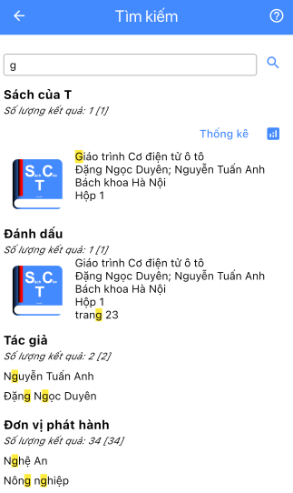
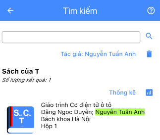

# Tìm kiếm

Màn hình tìm kiếm thông tin sách đã lưu.

## Tìm kiếm đơn giản

- Nhập từ khoá cần tìm vào ô. Sau đó nhấn `Search` (`Enter`) trên bàn phím hoặc nhấn vào nút `Kính lúp` trên màn hình.
- Nhấn vào dòng sách kết quả để xem chi tiết.
- Nhấn vào `Thống kê` để xem tổng kết thống kê danh sách các sách kết quả tìm kiếm.

 
 
 
 
 
 
 
 

## Tìm kiếm nâng cao

- Để thêm các điều kiện tìm kiếm, tìm kiếm theo từ khoá như bình thường.
- Trên màn hình kết quả, chọn 1 điều kiện lọc, ví dụ chọn 1 tác giả. Màn hình tìm kiếm sẽ bắt đầu tìm kiếm lại với điều kiện lọc là tác giả đã chọn.
- Tiếp tục nhập từ khoá, màn hình tìm kiếm sẽ tìm các sách theo từ khoá đã nhập **và** có tác giả đã chọn. (các mục khác vẫn tìm kiếm theo từ khoá để cho phép chọn thêm điều kiện lọc).
- Có thể nhấn vào 1 điệu kiện lọc đã chọn để loại bỏ nó.
- Ví dụ ứng dụng thống kê:
  - Nhập từ khoá để tìm và chọn 1 Vị trí làm điều kiện lọc.
  - Màn hình tìm kiếm sẽ tìm các sách có vị trị đã chọn.
  - Nhấn vào `Thống kê` để xem tại vị trí đã chọn có bao nhiêu cuốn sách, có những tác giả nào ...
