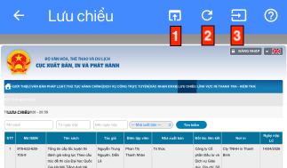
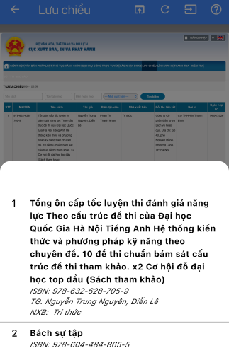

# Màn hình web

Màn hình hiển thị trang web và cung cấp công cụ nhập dữ liệu.

> Lưu ý: bản thân ứng dụng không cung cấp trang web nào. Màn hình này hiển thị các trang web công cộng của các đơn vị ngoài.

- Mục 1: mở trang web gốc trong trình duyệt mặc định của hệ thống.
- Mục 2: nạp lại trang web gốc.
- Mục 3: tiện ích nhập dữ liệu (chỉ khả dụng từ màn hình nhập sách mới).

 
 
 
 
 
 
 
 
 
 
 
 
 
 
 
 
 
 
 
 
 
 
 
 
 
 
 
 
 

## Tiện ích nhập liệu:

- Tiện ích đóng vai trò như nút Sao chép (Copy & Paste) nội dung trang web.

- Nhấn vào nút số 3, sau đó chọn 1 mục trong danh sách hiển thị ở dưới, các dữ liệu đã chọn sẽ được tự động gán vào các trường tương ứng ở màn hình nhập thông tin sách.

> Lưu ý: trang web không được cung cấp bởi ứng dụng này; tiện ích sao chép dữ liệu trực tiếp từ nội dung hiển thị trên màn hình, trang web có thể thay đổi, nên tiện ích này không đảm bảo thực hiện chính xác như mong đợi.
