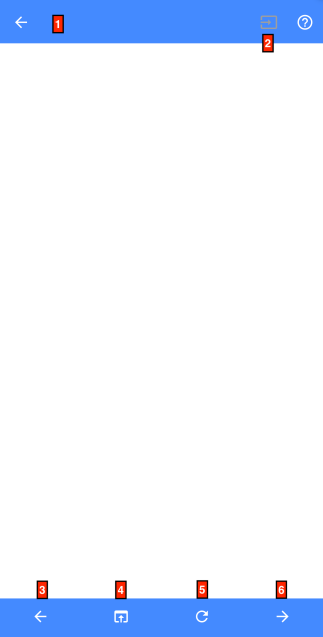

# Màn hình web

Màn hình hiển thị trang web và cung cấp công cụ nhập dữ liệu.

> Lưu ý: bản thân ứng dụng không cung cấp trang web nào. Màn hình này hiển thị các trang web công cộng của các đơn vị ngoài.

- Mục 1: phần tiêu đề màn hình, nhấn vào đây để mở hộp thoại danh sách các trang web được hỗ trợ và chuyển sang.
- Nút 2: tiện ích nhập dữ liệu. Nút này chỉ khả dụng khi đạt 2 điều kiện:
  - Trang web đã nạp xong.
  - URL trang web nằm trong cấu hình hỗ trợ.
- Nút 3, 6: di chuyển lùi / tiến giữa các trang web đã xem.
- Nút 4: mở trang web gốc trong trình duyệt mặc định của hệ thống.
> Lưu ý nếu chọn mở trang web trong trình duyệt mặc định của hệ thống (bên ngoài `Sách của T`) thì không sử dụng được chức năng nhập liệu.
- Nút 5: nạp lại trang web hiện tại.

## Chức năng nhập liệu:

- Chức năng đóng vai trò như nút Sao chép (Copy & Paste) nội dung trang web.
- Nhấn vào nút số 2 để nhập dữ liệu từ trên web vào thông tin sách:
  - Đối với trang web có nhiều kết quả: ứng dụng sẽ mở một hộp thoại danh sách để chọn.
  - Đối với trang web chỉ có 1 kết quả: `Sách của T` tự động chuyển về màn hình **Sách**.

> Lưu ý: trang web không được cung cấp bởi ứng dụng này; tiện ích sao chép dữ liệu trực tiếp từ nội dung hiển thị trên màn hình, trang web có thể thay đổi, nên chức năng này không đảm bảo thực hiện chính xác như mong đợi.
